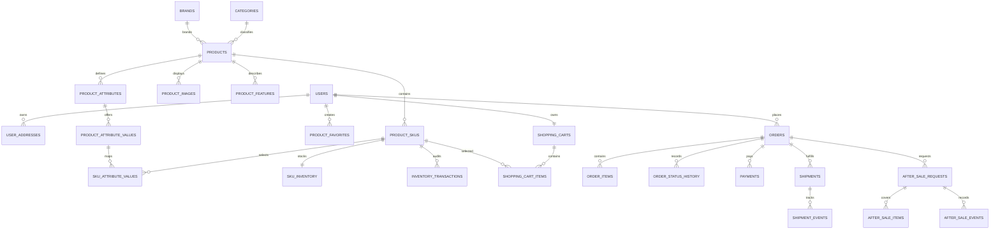

# SUPER MALL 数据库设计

## 1. 目标与范围

第一版是自营数码商城，使用 MySQL 作为唯一事务数据库，由 Spring Boot 模块化单体访问。模型覆盖已完成 Vue3 前端中的用户、地址、收藏、商品目录、SKU、库存、购物车、订单、支付、物流和售后。商户、店铺、分账、复杂促销、评论明细和数据仓库暂不建表；未来通过 Flyway 增量迁移扩展。

### 非功能要求

- 订单、支付和库存使用 InnoDB 事务，关键金额与库存必须由后端计算。
- 金额统一使用 `DECIMAL(12,2)`，禁止使用浮点类型。
- 商品详情与普通查询目标为 500ms 内，常用筛选与用户订单查询必须有组合索引。
- 用户、商品和地址采用软删除；订单、支付、库存流水只追加或状态变更，不做业务硬删除。
- 所有时间使用 `DATETIME(3)`，应用统一按 Asia/Shanghai 解释并通过 API 输出 ISO-8601。
- 数据库凭据来自环境变量，不提交到 Git。
- 当前部署保持单机 MySQL；生产阶段要求每日备份并定期恢复演练。

## 2. 领域关系

## 3. 表分组

| 模块 | 表 | 设计要点 |
|---|---|---|
| 用户 | `users`, `user_addresses`, `product_favorites` | 邮箱和手机号分别唯一；默认地址由业务事务保证唯一 |
| 商品 | `categories`, `brands`, `products`, `product_images`, `product_features` | 商品使用稳定 slug；聚合评分和销量用于列表查询 |
| SKU | `product_attributes`, `product_attribute_values`, `product_skus`, `sku_attribute_values` | 规格规范化，支持颜色、容量、内存等任意组合 |
| 库存 | `sku_inventory`, `inventory_transactions` | 可用、锁定、已售分离；乐观锁防止并发覆盖 |
| 购物车 | `shopping_carts`, `shopping_cart_items` | 每个用户一个购物车；同一 SKU 唯一 |
| 订单 | `orders`, `order_items`, `order_status_history` | 保存商品和地址快照，历史不随主数据变化 |
| 履约 | `payments`, `shipments`, `shipment_events` | 支付与物流独立于订单主状态，可保留多次尝试和拆分配送 |
| 售后 | `after_sale_requests`, `after_sale_items`, `after_sale_events` | 一张服务单可覆盖多个订单项，进度完整留痕 |

## 4. 状态模型

数据库使用可扩展的 `VARCHAR` 状态码，不使用 MySQL `ENUM`。Java 层后续用枚举约束合法值。

- 订单：`PENDING_PAYMENT → PROCESSING → SHIPPED → COMPLETED`
- 订单旁路：`PENDING_PAYMENT → CANCELLED`
- 支付：`UNPAID → PAID → PARTIALLY_REFUNDED → REFUNDED`
- 履约：`UNFULFILLED → PICKING → SHIPPED → DELIVERED/RETURNED`
- 售后：`NONE → REQUESTED → PROCESSING → COMPLETED/REJECTED/CANCELLED`

每次订单、物流和售后状态变化都写入对应历史表。状态历史既支持前端时间线，也为未来运营 Agent 和数据中台提供可审计数据。

## 5. 一致性规则

1. 结算时从数据库重新读取 SKU 价格和库存，忽略前端提交的金额。
2. 创建订单、锁定库存、清空购物车在同一事务中完成。
3. 支付回调以支付流水号做幂等控制；已支付订单不得重复入账。
4. 发货和确认收货只允许从合法前置状态转换。
5. 售后金额不得超过对应订单项的可售后金额。
6. 商品与地址允许更新，但订单中的名称、规格、单价、图片和地址使用快照字段。

## 6. 索引策略

- 商品：唯一 slug，分类/状态/排序、品牌/状态、活动标记组合索引。
- SKU：唯一 SKU 编码，商品/状态组合索引。
- 订单：唯一订单号，用户/状态/创建时间和支付状态组合索引。
- 支付：唯一支付单号和渠道交易号，订单/状态组合索引。
- 库存流水：SKU/创建时间、业务引用编号索引。
- 售后：唯一服务单号，用户/状态/创建时间和订单索引。

索引优先服务当前前端真实查询，不为尚未实现的报表创建大量冗余索引。

## 7. 失败模式与处理

| 失败 | 风险 | 处理方式 |
|---|---|---|
| 创建订单时库存不足 | 超卖 | 库存行乐观锁或条件更新，事务回滚 |
| 支付回调重复 | 重复入账 | 支付单号与渠道交易号唯一，业务幂等 |
| 商品下架或删除 | 历史订单无法展示 | 订单项保存快照，外键允许置空 |
| 地址被用户修改 | 历史配送地址变化 | 订单保存完整地址快照 |
| 迁移执行中断 | 数据库半升级 | Flyway 版本记录；上线前备份并在同版本恢复后重试 |
| 数据库不可用 | 商城读写中断 | 健康检查、告警、备份与恢复演练；后续按业务量引入高可用 |

## 8. 后续扩展

- 多商户：新增 `merchants`、`stores`、商户商品与订单拆单，不修改消费者订单快照原则。
- 运营 Agent：通过受权限控制的应用服务写入，不授予数据库直连写权限。
- AI 客服：只调用 Spring Boot 工具接口，订单与用户数据经过身份校验和脱敏。
- 数据中台：业务稳定后引入 Outbox 事件表或 CDC，不在 MVP 中预建无人消费的消息基础设施。

